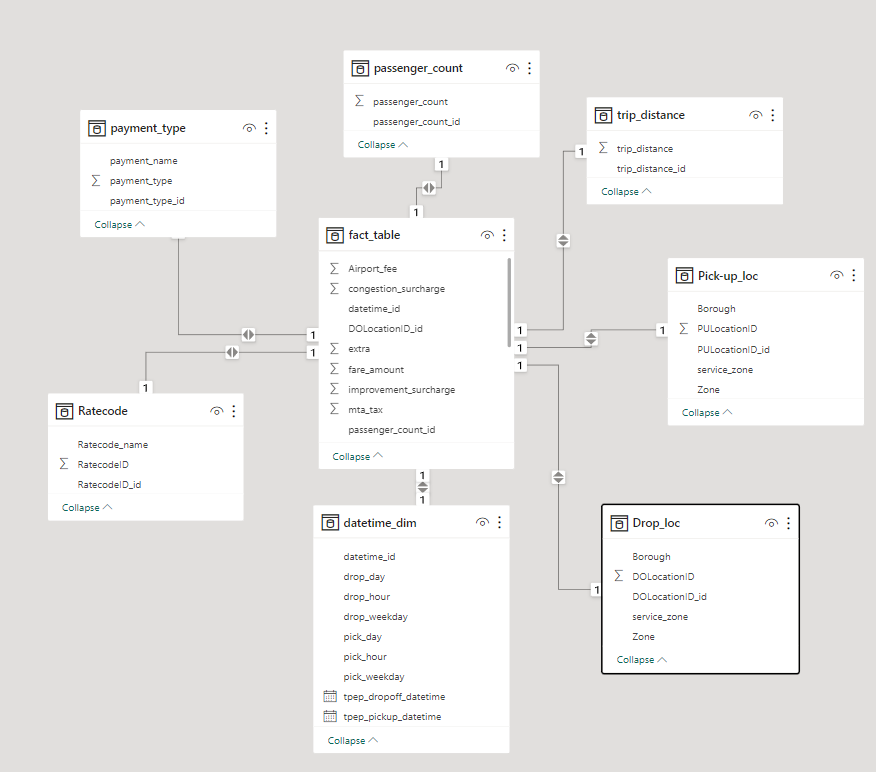
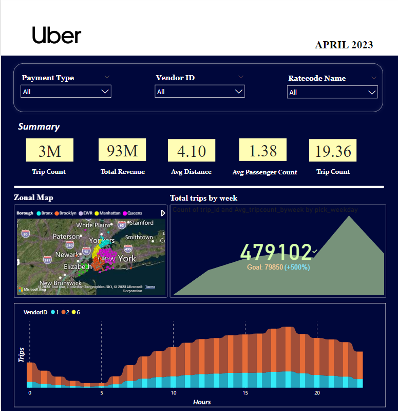

# Uber-Data-Analysis
<h2>Introduction</h2>
The goal of this project is to perform data analytics on Uber data using Python Pandas and Power BI.
<h2>Datasets Used</h2>
Uber Fares Dataset records include fields capturing pick-up and drop-off dates/times, pick-up and drop-off locations, trip distances, itemized fares, rate types, payment types, and driver-reported passenger counts. 
Dataset used in this project: <a href="https://d37ci6vzurychx.cloudfront.net/trip-data/yellow_tripdata_2023-04.parquet">Yellow Taxi Trip Records-April 2023</a>
  
More info about dataset can be found here:

Website - <a href="(https://www.kaggle.com/datasets/yasserh/uber-fares-dataset)">https://www.nyc.gov/site/tlc/about/tlc-trip-record-data.page</a> 
<h2>Data Model</h2>

<h2>Power BI Dashboard</h2>
Dashboard will be available in below link, 
<a href="https://www.novypro.com/project/uber-trip-analysis">Uber-Analysis-Dashboard</a>  
Dashboard will look like

